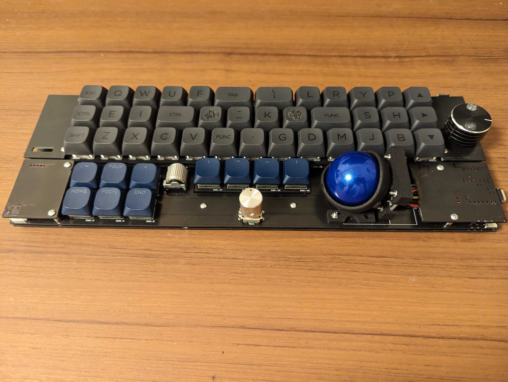
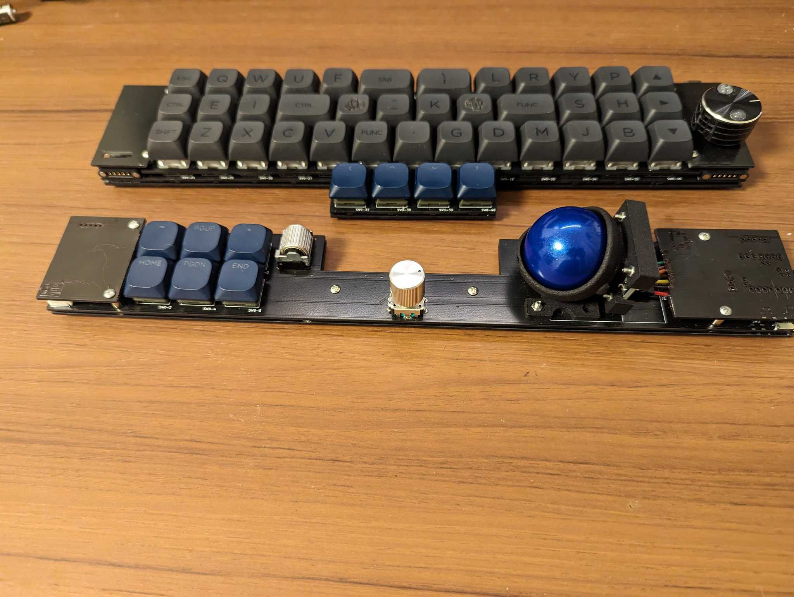
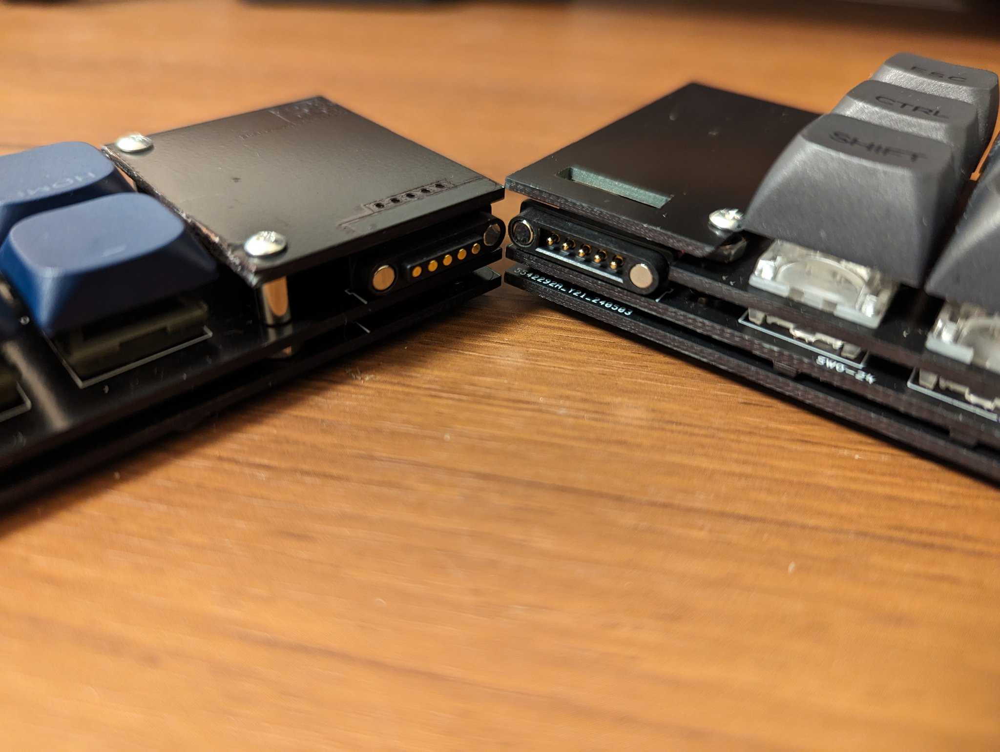
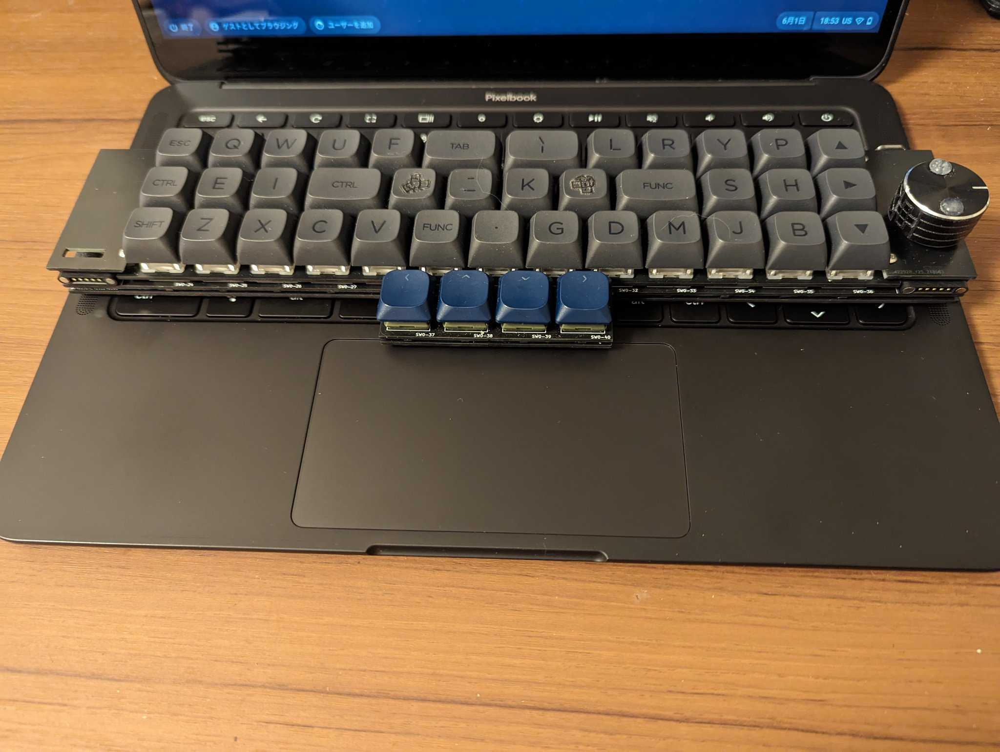

# s3kb

* 42key + 6key
* 3encoders
* trackball

separatable into front/back

Magnetic connector allows you to connect the left and right sides and charge them at the same time.

The front keyboard can be used on a laptop

## schematics

